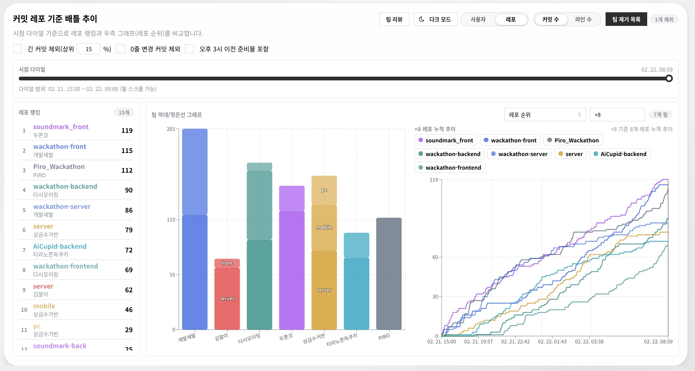

# localhost-commit-analysis

2026 와커톤 참가팀의 Git 커밋 로그를 수집하고, 협업 흐름을 시각적으로 분석하는 프로젝트입니다.




## 배포 주소

https://yabsed.github.io/localhost-commit-analysis/

## 핵심 모드

### Team Review

- 단일 JSON 데이터(`commit_crawler/json/*.json`)를 선택해 상세 분석
- 타임라인: 커밋 시간순 배치 + 프로젝트 간 선후 관계 + 작성자 크로스 이동선
- 누적 스택 차트:
  - 커밋 수 / 라인 수 전환
  - 레포 기여율(%) 모드
  - 긴 커밋 상위 N% 제외
  - 0줄 변경 커밋 제외(커밋 모드) / 순변경(+/-) 계산(라인 모드)
- 시간 추이 차트:
  - 레포별/사용자별 누적 추이
  - 현재 타임라인 위치 기준 Reference 라인 표시
- 작성자 병합 규칙(.txt) 파일 선택/재로딩/즉시 적용 지원
- 데이터 소스 URL 고정: `?source=<파일명>.json`

### Team Battle

- `commit_crawler/json/*.json` 파일들을 팀 단위로 동시 로드해 비교
- 분석 시점 윈도우: `2026-02-21 15:00:00 +09:00` ~ `2026-02-22 09:00:00 +09:00`
- 시점 다이얼(슬라이더/휠)로 특정 시점 랭킹과 그래프를 동기화
- 옵션:
  - 긴 커밋 상위 N% 제외
  - 0줄 변경 커밋 제외(커밋 모드) / 순변경(+/-) 계산(라인 모드)
  - 오후 3시 이전 준비 커밋 포함
- 우측 그래프 모드:
  - 사용자 순위(`+8`, `-8` 같은 토큰 입력으로 Top/Bottom 라인 선택)
  - 팀별 순위(`+8`, `-8` 같은 토큰 입력으로 Top/Bottom 라인 선택)
  - 레포 순위(`+8`, `-8` 같은 토큰 입력으로 Top/Bottom 라인 선택)
  - 프런트 vs 백엔드 누적 추이(레포명 기준 분류)
- 팀 제거 목록(특정 팀 제외) 지원

## 라우팅

- `/` : Team Review
- `/team-battle` 또는 `/battle` : Team Battle
- 해시 라우팅도 지원 (`#/team-battle`, `#/battle`)

## 프로젝트 구조

```text
.
├─ commit_crawler/
│  ├─ commit_crawler.py                # 전체 파이프라인 실행
│  ├─ input.txt                        # 분석 대상 레포 목록
│  ├─ workers/
│  │  ├─ crawl_git_logs.py             # git log 수집
│  │  └─ merge_git_logs_to_json.py     # 로그 병합(JSON 생성)
│  └─ json/                            # 앱에서 읽는 분석 데이터(.json)
├─ interactive_app/
│  ├─ src/                             # 시각화 앱 코드
│  ├─ scripts/prepare-static-data.mjs  # 정적 배포용 데이터 복사 + manifest 생성
│  ├─ author_identity_rules.txt        # 기본 작성자 병합 규칙 파일
│  ├─ public/data/                     # prepare:data 결과물
│  └─ package.json
└─ .github/workflows/deploy-interactive-app.yml
```

## 요구 사항

- Node.js 20+
- npm
- Python 3.10+
- Git CLI

## 빠른 시작 (로컬)

1. 커밋 데이터 생성/갱신

```bash
python3 commit_crawler/commit_crawler.py
```

2. 프런트 실행

```bash
cd interactive_app
npm ci
npm run dev
```

3. 접속

- Team Review: `http://localhost:5173/`
- Team Battle: `http://localhost:5173/team-battle`

## 개발 서버 API (Vite 미들웨어)

- `GET /api/commit-logs`
- `GET /api/commit-log?file=<name>.json`
- `GET /api/identity-rule-files`
- `GET /api/identity-rule-file?file=<name>.txt`

## commit_crawler 사용법

### 입력 파일 (`commit_crawler/input.txt`)

한 줄에 하나씩 입력합니다.

- `https://github.com/owner/repo.git`
- `https://github.com/owner/repo`
- `owner/repo` (자동으로 GitHub URL 변환)
- `owner/repo -> backend` (source alias 지정)
- 로컬 경로도 호환 지원

### 주요 옵션

```bash
python3 commit_crawler/commit_crawler.py \
  --force \
  --no-prune \
  --disable-cutoff-filter
```

- `--force`: 기존 `.txt`가 있어도 다시 수집
- `--no-prune`: 현재 `input.txt`에 없는 오래된 로그 파일 자동 정리 비활성화
- `--disable-cutoff-filter`: 병합 시 컷오프 필터 비활성화

### 컷오프 필터 기본값

기본값은 `2026-02-22 09:00:00 +09:00` 이후 커밋을 병합 JSON에서 제외합니다.

## 작성자 병합 규칙 형식

`interactive_app/*.txt` 파일을 규칙 파일로 사용합니다.

- `사용자A - 사용자B`
- `사용자A -> 사용자B`
- `사용자A,사용자B`
- `사용자A<TAB>사용자B`

주석(`#`)과 빈 줄은 무시됩니다. 형식 오류 줄은 경고 후 제외됩니다.

## 빌드/배포

### 로컬 빌드

```bash
cd interactive_app
npm run build
```

`npm run build`는 내부에서 `npm run prepare:data`를 먼저 실행합니다.

- `commit_crawler/json/*.json` -> `interactive_app/public/data/commit-logs/`
- `interactive_app/*.txt` -> `interactive_app/public/data/identity-rules/`
- `interactive_app/public/data/manifest.json` 생성

### GitHub Pages 빌드

```bash
cd interactive_app
npm run build:pages
```

- base path: `/localhost-commit-analysis/`
- `dist/index.html`을 `dist/404.html`로 복사해 새로고침 라우팅 대응
- 워크플로우: `.github/workflows/deploy-interactive-app.yml`

## 참고

- 와커톤 소개: https://jet-coral-9d0.notion.site/2026-2e770e37e9c7801e8994e43d9ae6a3cf
- 크롤러 상세 설명: `commit_crawler/README.md`
