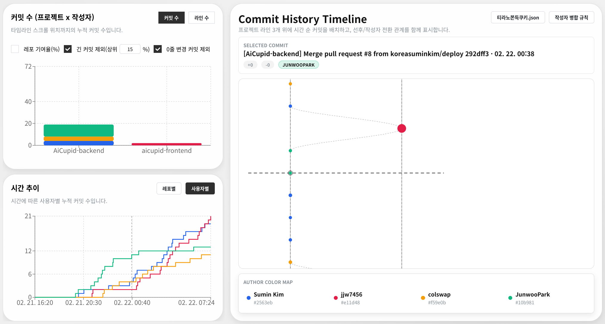

# localhost-commit-analysis

- **2026 와커톤**에 참가한 팀들의 개발 레포지토리를 분석하기 위해 만든 **커밋 분석 도구**입니다.
- **팀의 협업 흐름**과 **기여 패턴**을 시간축에서 읽을 수 있도록 설계했습니다.




## 프런트 배포 주소

### **https://yabsed.github.io/localhost-commit-analysis**

- 앱: `interactive_app` (React + Vite + Recharts)
- 데이터 수집/병합: `commit_crawler` (Python)

## 배경


- 분석 대상: 2026 와커톤 참가자/참가팀 개발 레포지토리
- 목적: 커밋 히스토리를 기반으로 팀별 협업 방식, 작성자 전환, 코드 기여 흐름을 정량적으로 확인
- 2026 와커톤 소개: https://jet-coral-9d0.notion.site/2026-2e770e37e9c7801e8994e43d9ae6a3cf

## 주요 기능

- Commit History Timeline
  - 프로젝트 라인(예: Mobile/PC/Server) 위에 커밋을 시간순으로 배치
  - 프로젝트 내부 연결, 프로젝트 간 선후 관계, 작성자 크로스 프로젝트 이동선을 함께 표시
  - 커밋 선택 시 해시/시간/라인 변경량/작성자 정보 확인
- 누적 스택 차트
  - 프로젝트 x 작성자 기준으로 커밋 수 또는 라인 수 누적 비교
  - 레포 기여율(%) 모드 지원
  - 긴 커밋 상위 N% 제외, 0줄 변경 커밋 제외, 순변경(+/-) 계산 옵션
- 시간 추이 차트
  - 레포별/사용자별 누적 추이 확인
  - 커밋 수 또는 코드 라인 기준 전환
- 데이터 소스 전환
  - `commit_crawler/json/*.json` 중 분석 파일 선택
  - URL 쿼리 `?source=<파일명>.json` 로 특정 데이터 소스 고정 가능
- 작성자 병합 규칙
  - `interactive_app/*.txt` 규칙 파일을 불러와 동일 작성자(alias) 통합
  - 예: `Seo Minseok - user983740`

## 프로젝트 구조

```text
.
├─ commit_crawler/
│  ├─ commit_crawler.py                # 전체 파이프라인 실행
│  ├─ input.txt                        # 분석 대상 레포 목록
│  ├─ workers/
│  │  ├─ crawl_git_logs.py             # git log 수집
│  │  └─ merge_git_logs_to_json.py     # 로그 병합(json 생성)
│  └─ json/                            # 앱에서 읽는 분석 데이터(.json)
├─ interactive_app/
│  ├─ src/                             # 시각화 앱 코드
│  ├─ scripts/prepare-static-data.mjs  # Pages 배포용 정적 데이터 복사/manifest 생성
│  ├─ author_identity_rules.txt        # 작성자 병합 규칙 기본 파일
│  └─ package.json
└─ .github/workflows/deploy-interactive-app.yml
```

## 요구 사항

- Node.js 20 권장 (GitHub Actions 기준)
- npm
- Python 3.10+
- Git CLI

## 빠른 시작 (로컬 개발)

1. 의존성 설치

```bash
cd interactive_app
npm ci
```

2. 개발 서버 실행

```bash
npm run dev
```

개발 모드에서는 Vite 서버가 아래 API를 제공합니다.

- `GET /api/commit-logs`
- `GET /api/commit-log?file=<name>.json`
- `GET /api/identity-rule-files`
- `GET /api/identity-rule-file?file=<name>.txt`

## 데이터 갱신 방법

1. 대상 레포 목록 수정: `commit_crawler/input.txt`
2. 전체 파이프라인 실행:

```bash
python3 commit_crawler/commit_crawler.py
```

### 컷오프 필터 주의

기본 설정은 `2026-02-22 09:00:00 +09:00` 이후 커밋을 병합 JSON에서 제외합니다.  
필터를 끄려면:

```bash
python3 commit_crawler/commit_crawler.py --disable-cutoff-filter
```

## 빌드/배포

### 로컬 빌드

```bash
cd interactive_app
npm run build
```

- `build` 시 `npm run prepare:data`가 먼저 실행되어:
  - `commit_crawler/json/*.json` -> `interactive_app/public/data/commit-logs/`
  - `interactive_app/*.txt` -> `interactive_app/public/data/identity-rules/`
  - `interactive_app/public/data/manifest.json` 생성

### GitHub Pages 빌드

```bash
cd interactive_app
npm run build:pages
```

- Pages base 경로: `/localhost-commit-analysis/`
- 워크플로우: `.github/workflows/deploy-interactive-app.yml`
- 트리거:
  - `main` 브랜치에 push
  - `interactive_app/**`, `commit_crawler/json/**`, 워크플로우 파일 변경 시

## 참고

- `commit_crawler/README.md`에 수집 파이프라인 옵션이 더 자세히 정리되어 있습니다.
